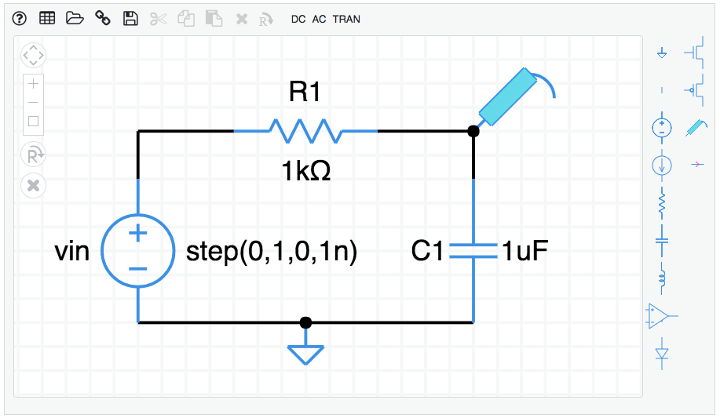
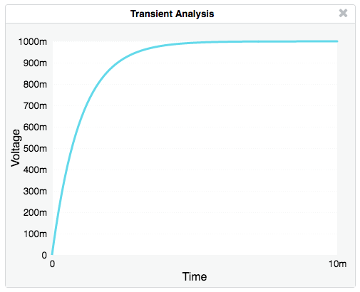

# Circuit-sandbox

A simulator for experimenting with circuits.

[Circuit sandbox](https://willymcallister.github.io/Circuit-sandbox/index.html) (English)

[Circuit sandbox](https://willymcallister.github.io/Circuit-sandbox/index-es.html) (Español)

## Playing in the circuit sandbox

To create a circuit, drag components from the parts bin on the right, onto the schematic diagram.

The result of a *transient* analysis is a plot of voltage vs. time.

## Getting started

Drag components from the parts bin onto the main screen.

Add wires by dragging between components connection points (small circles).

Tap on the Rotate R&#x2935;  icon or type  **"r"** on the keyboard to rotate a component.

Tap on X or type BACKSPACE to delete a component.

Double-tap on a component to change its properties, like resistance value.

Add a ground symbol (triangle shape at the top of the parts bin).

Add voltage or current probes to the nodes you want to plot.

Select DC, AC, or TRAN from the menu to simulate the circuit.

If you have a touch device (tablet or smartphone):

* One finger selects components or drags a selection rectangle 
* Two fingers pan the schematic window

How to build the circuit shown above

To create the RC circuit shown above, follow these steps starting from a blank schematic.

* Add components (a voltage source, resistor, and capacitor). Click on a component in the parts bin on the right, then click on the schematic. Or, you can mouse down on a component in the bin and drag it to the schematic.
* Select the resistor by clicking on it. It will turn green. While it is selected, hit the **"r"** key on the keyboard to make it rotate to horizontal. You can also click on the R&#x2935;  icon. Rotate several times to see what happens.
* Position components on the page by dragging them around.
* Add wires by dragging between the connection points on the components. If you make a mistake, hit the backspace/delete key on your keyboard to delete whatever is selected, or click on the X icon.
* Specify a ground node by dragging the ground symbol from the parts bin (the triangle with a stick) and connect it to the bottom of the voltage source.
* Adjust the component properties. Double-click on the voltage source and change its type to "step". Give it a name if you want. In the same way, change the resistor value to 1k, and the capacitor value to 1u. The k and u suffixes are short for 10^3 and 10^-6.
* Add a voltage probe to the top node of the capacitor. (The thing in the parts bin that looks like a voltmeter probe.) This is the voltage we will plot.
* Select an analysis to perform. For this example, let's do a transient analysis. Click TRAN in the menu. Set the stop time to 10m. The m stands for 10^-3 so we will simulate for 10 milliseconds.
* Click OK. The simulation is performed and a plot should appear.

Here is a complete RC circuit schematic. Copy and paste this entire URL into a browswer. 

    https://willymcallister.github.io/Circuit-sandbox/?value=[["v",[152,80,0],{"name":"vin","value":"step(0,1,0,1n)","_json_":0},["2","0"]],["r",[232,64,1],{"name":"R1","r":"1k","_json_":1},["1","2"]],["c",[264,80,0],{"name":"C1","c":"1u","_json_":2},["1","0"]],["w",[152,80,152,64]],["w",[152,64,184,64]],["w",[232,64,264,64]],["w",[264,64,264,80]],["g",[208,128,0],{"_json_":7},["0"]],["w",[152,128,208,128]],["w",[264,128,208,128]],["s",[264,64,0],{"color":"cyan","offset":"0","_json_":10},["1"]],["view",110.6424,32.20688,3.814697265625,"50","10","1G",null,"100","10m","1000"]]

## Actions 

**Add a component**: Tap on a part in the parts bin, then tap on the schematic to add.

**Add a wire**: Wires start at connection points (open circles). Touch on a connection to start a wire, drag, and release.

**Select**: Drag a rectangle to select components. 
Shift-click to include another component (desktop only).

**Move**: Touch and drag to a new location.

**Delete**: Tap to select, then tap the X icon or hit BACKSPACE on the keyboard.

**Rotate/Reflect**: Tap to select, then tap on the Rotate icon or type the letter "**r**" to rotate 90. Repeat for more rotations and reflections (8 total).

**Properties**: Double-tap on a component to change its properties, like resistance or voltage.

**Numeric suffixes**: Numbers can be entered using engineering notation:

    T    10^12          m   10^-3 
    G    10^9           u   10^-6  
    M    10^6           n   10^-9  
    k    10^3           p   10^-12
                        f   10^-15

example: 1000 can be entered as 1k

## On-screen controls 
Scroll/Pan:  

Zoom in/out/all: 

Rotate:  

Delete: 

## Menu

**Help**: Display the Actions information shown above. 

**Grid**: Toggle the background grid on and off.

**Open netlist**: Open a saved netlist.

**Shared link**: Displays a link you can copy for sharing your circuit with others.

**Save netlist**: Save the current netlist. See System information below for how this works on different platforms.

**Cut/Copy/Paste** The usual edit functions.  

> Mac shortcuts: &#8984;-X, &#8984;-C, &#8984;-V  
> PC shortcuts: ctl-X, ctl-C, ctl-V

**Delete**: Delete the selected components.

**DC**:  Find the DC voltages and currents, also called the *operating point*.

**AC**: Sweep the AC frequency, plots voltage or current vs. frequency.

**TRAN**: Transient response. Find the time response, plot voltage or current vs. time.

## Device models

The simulator has simple models for semiconductor devices and an operational amplifier, with just a few adjustable parameters. For more sophisticated simulations, check out the other circuit simulator resources mentioned below. 

The default diode saturation current is 1.0 * 10^-14 A. The *area* parameter scales saturation current: is = a * is. 

## System information

The circuit sandbox works best in a desktop or laptop computer environment where you have plenty of viewing area. You can also use it on a tablet. (It works on smartphone, too, but the experience is a bit awkward because the screen is so small.) 

### Desktop/laptop

The `SAVE` function saves a circuit text file (JSON format) to the Download folder on your computer.  The `OPEN` function retrieves a circuit text file from anywhere you choose in your computer's file system. If you want to keep your work, be sure to `SAVE` your circuit before leaving the web page. Your circuit is never transferred from your computer to a web server.

The downloaded netlist file is named *ckt.txt*. (text file, JSON, JavaScript Object Notation).

### Tablet 

The simulator has a touch interface. On a tablet you can save *one* circuit file. When you `SAVE` a circuit, it is tucked into a memory area inside your browser. When you `OPEN` the saved circuit, the circuit file is retrieved from browser memory. If you want to keep your work, be sure to `SAVE` before leaving the web page.

### Other mobile devices

The simulator works on a smartphone, but the display is a bit small for drawing schematics. You can pan the screen by touching down two fingers at once and dragging the window. You can save and load a single circuit file, the same as for a tablet.

## Languages and translation

If you would like to translate the Circuit Sandbox into other languages, it's fairly simple. As a model, look at the Spanish strings file named es.js compared to the original English strings, en-US.js. If you prepare a translation file in your favorite language, mail it to me and I will include it. The Circuit Sandbox has been translated into:

* English, en-US.js
* Spanish, es.js

## The circuit sandbox was created at MIT

The Circuit Sandbox simulator was created at MIT by Professor Chris Terman in 2011, and was used by the very first massively-open-online class (MOOC), MIT 6.002x. It was transferred to EdX in 2012. I made further improvements to the simulator interface while I was at Khan Academy in 2016, and since then.

The Circuit Sandbox is *not* a version of SPICE. It is its own version of a circuit simulator. It includes schematic capture and a circuit simulation engine. The simulator is 100% Javascript and does not require installation. All you have to do is click on the link to the simulator.

The Circuit Sandbox is licensed under the MIT License and is also part of the EdX-platform. The simulator works in most modern browsers on Windows, Mac, and Linux machines. 

## Other circuit simulators

The granddaddy of all circuit simulation programs is SPICE (Simulation Program with Integrated Circuit Emphasis). This program was created at the University of California, Berkeley in the 1970's. It was originally written in FORTRAN and has always been in the public domain. 

The input to SPICE is a plain-text circuit description (the SPICE netlist). SPICE is the workhorse of the electronics industry because it supports sophisticated models for semiconductor devices (diodes and many types of transistors). 

Many people have written front-end interfaces to SPICE that allow designers to create SPICE netlists by drawing schematics. The SPICE netlist is submitted to SPICE for simulation. The results are retrieved from SPICE and plotted.  Many of these packages can be found by searching the web for "circuit simulator." 

An excellent version of SPICE is available from [Linear Technology](http://www.linear.com/), a semiconductor manufacturing company in Milpitas, California. The program is called [LTspice](http://www.linear.com/designtools/software/#LTspice). LTspice runs on Windows, Macintosh, and Linux machines with Windows emulation. It is free to download and use."

## Acknowledgements

schematic.js   &copy; *2012 EdX*,  &copy; *2011 MIT EECS*

Khan Academy software is made available under the [MIT License](https://opensource.org/licenses/MIT).  

This circuit simulator is part of the EdX Platform, licensed under the 
[GNU AFFERO GENERAL PUBLIC LICENSE](https://github.com/edx/edx-platform/blob/master/LICENSE)
Version 3, 19 November 2007. More information at [EdX licensing](https://open.edx.org/open-edx-licensing).

#### Libraries

The simulator uses two open-source libraries:  

[Download.js](http://danml.com/download.html) is licensed under the [Creative Commons Attribution 4.0 International License](https://creativecommons.org/licenses/by/4.0/), attributed to "dandavis". No changes were made. Download.js allows to circuit files to be downloaded to the client computer.

[Hammer.js](http://hammerjs.github.io/) is available under the [MIT License](https://github.com/hammerjs/hammer.js/blob/master/LICENSE.md). No changes were made. Hammer.js provides touch functionality, in particular, the double-tap function for touch interfaces.

This version of the circuit sandbox simulator includes additions by Willy McAllister, EE Content Fellow at Khan Academy during 2016:

* Save/Load netlist, sharable link
* Touch sensitivity for tablets and smartphone
* Language extensions
